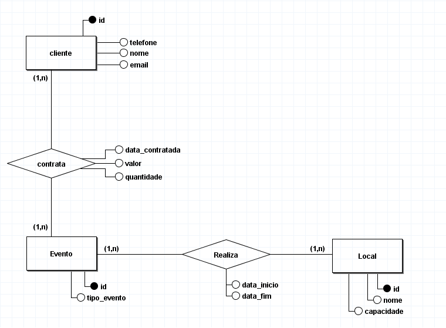

# Organizador de Eventos

## Descrição
Este é um projeto proposto em aula como parte da prática profissional em programação web. O objetivo é desenvolver um sistema de organização de eventos, onde os usuários podem preencher suas preferências de evento e localização.

## Diagrama Inicial do Banco de Dados
Será criado um Banco de Dados SQL server. Abaixo está o diagrama inicial do banco de dados:

